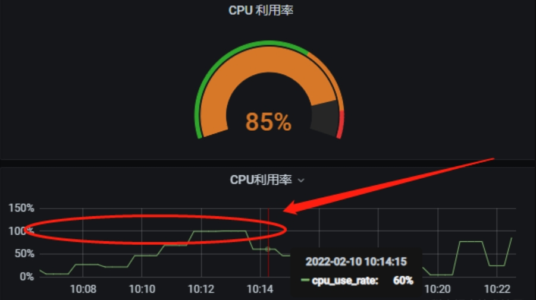

[toc]

**关键信息**
**（1）某个正常接口在某段时间突然变慢**
**（2）数据库监控CPU飙升到100%**

## 问题描述

测试反馈某个接口超时失败，并且这段时间接口返回时间过长。

## 问题排查

### （1）观察日志以及请求链路

由于这个接口已经上线一段时间了，一开始推测是某种筛选条件下没走查询所致。于是查看请求记录的日志以及前后链路，发现调用方报错RPC
超时，被调用方报错SQL Exception 1094（查询超时被kill）。

结论----应该是SQL查询过慢引起的问题。

### （2）简单explain并执行SQL语句

explain SQL发现走了简单索引，扫描行数大概是10000条左右，取了20条数据。手动执行了SQL，查询时间为1.5s左右（这种数量级的查询，
这种查询时间是不合理的）。

结论----SQL执行过慢，并且不是SQL语法的问题

### （3）观察数据库所在服务器状态

通过腾讯云服务器发现服务器的CPU使用率过高，如图下所示：

也可以使用在服务器使用top命令观察CPU状态，但是top只能查看当时。

## 解决方法

参考链接：https://juejin.cn/post/7062609955009871885

最后发现是由慢查询SQL引起的，优化SQL后解决。