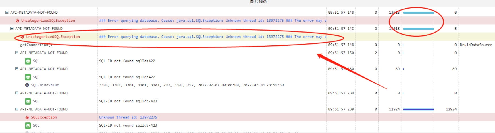
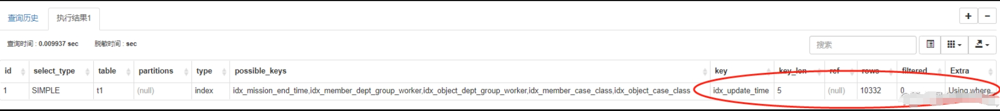

[toc]

**关键信息 （1）SQL出现多种条件查询并且需要排序 （2）执行器未选取正确索引**

## 问题描述

自动化用例接口报错，排查报错原因。

## 问题排查

### （1）观察日志

观察请求链路，发现SQL查询超时，如下所示

结论----SQL查询过慢，需要排查SQL

### （2）SQL分析

使用explain查看SQL简单的执行计划，发现执行了索引

**注意，当时以为该SQL走了索引不算慢SQL，去排查其他问题了，但是最后发现不是这样的**

分析发现，该条SQL存在多个条件字段查询，并且在最后使用另一个字段X进行排序。查看执行计划可以发现，MySQL为了避免排序，使用字段X的索引
进行查询，对于每条记录去主键索引进行匹配，直到取完限定行数结束。

由于匹配条件命中率较低，该查询效率较低（实际中执行平均10s，感觉和全表差不多）。

结论----MySQL为了避免进行排序，使用排序字段作为索引，但是由于SQL存在多种查询条件。低效率的索引导致了慢查询。

## 解决方法

分析了该多条件查询的SQL的查询场景，发现其中存在一个时间参数必须传递，向产品确认是否可以按照此参数排序，得到肯定的答复后，按照该
字段进行排序即可。优化后查询时间直接变为ms级。
