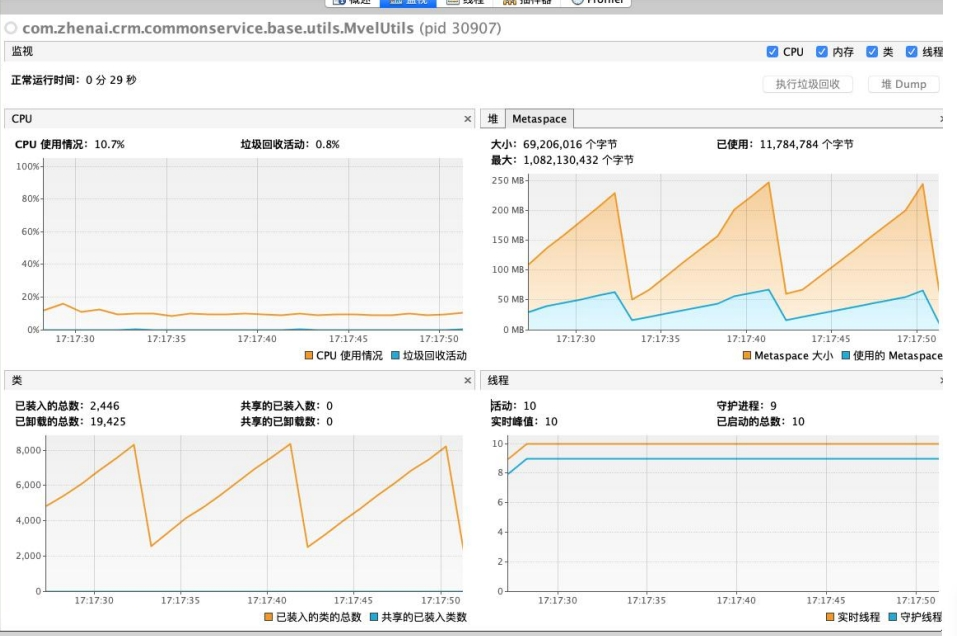

[toc]

**关键信息 （1）服务频繁出现full gc （2）使用动态语言技术**

## 问题描述

发现有一个java服务，频繁出现full gc 过程，导致存在大量慢接口

## 问题排查

### （1）观察JVM状态

在pinpoint看到对应的监控效果如下：

可以发现，jvm在进行频繁的full gc，再观察JVM的内存使用情况，发现这部分内存记录来自于堆外部分。分析可知JVM堆外主要存储的是静态变量以及类信息，
猜测项目中是否有代码在不断生成静态变量或者class文件。

### （2）定位问题

（1）查看代码提交记录，发现最近上线的一个需求使用到了mvel这个新技术。

（2）分析full gc时间段，发现频繁发生fullgc的时间段与高频调用mvel的时间段一致。

猜测----可能是引入了mvel技术，导致了元空间的不断膨胀。

### （3）问题复现与分析

（1）查询mvel技术文档，发现如下关键字：

**由于MVEL是动态运行时的动态语言,所以需要通过反射的对象让脚本访问字段和方法。**

分析可知，反射就是动态生成class文件。所以猜测就是频繁调用mvel导致频繁使用反射生成class文件，导致元空间一直膨胀。

（2）验证分析

使用压测技术压测mvel代码，分析JVM内存状态，如下：

发现压测时间端，加载类数量在一直上升，JVM堆外内存一直上升，确定就是mvel在一直生成类文件导致的频繁fullgc问题。

## 解决方法

  因为mvel技术是一门比较常见的动态语言，如果只是这么点并发量就有如此之大的性能隐患，不可能如此流行，怀疑是未能正确使用导致。
仔细查询mvel文档。发现如下关键内容：

**由于MVEL是动态运行时的动态语言,所以需要通过反射的对象让脚本访问字段和方法。但这严重影响性能,MVEL配备优化,为了最大限度地减少或消除反射调用的开销。默认情况下,MVEL有两个默认优化:反射优化器,ASM字节码优化器。**

发现目前的反射优化器是ASM字节码优化器，将之改为反射优化器，最终解决问题。