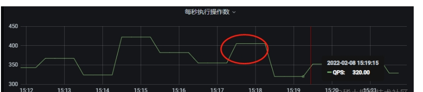
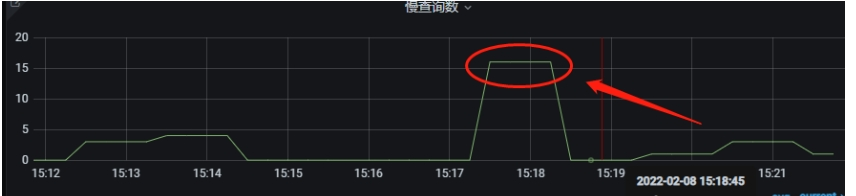

# CPU飙升的一般解决办法

## 背景

工作时，经常有测试会反馈某个接口很慢、超时失败，但是可能过一段时间又消失了。在观察接口逻辑时，发现这种情况下是因为数据库的CPU在某个时间段飙升，导致服务器不能正常处理
对于数据库的各种查询连接。而导致CPU飙升的原因有许多种，下面介绍一下如何排查CPU飙升的罪魁祸首。一般来说，由于数据库所在的云服务器基本上没有其他的软件。所以一般造成CPU
激增的原因有两个----请求激增以及慢查询。

这里以工作中使用的腾讯云MYSQL为例展示

## 确定大致原因

可以观察一下数据库的监控面板，如果每秒执行操作数以及每秒执行事务数发现在对应的时间点有突增，且时间点与CPU突增时间点一致，可以得出----CPU的飙升是由于客户本身的业务导致。
如果CPU激增时间段内，每秒执行操作数以及每秒执行事务数并未明显增加，并且面板上的慢查询数激增，那么可以得出----CPU的飙升是由于慢查询导致。

慢查询导致的CPU飙升如下图所示

## 请求激增

请求激增造成CPU飙升的一般解决方法如下

（1）分析是否还存在SQL优化的空间，比如把多次请求改成批量请求，把不必要的字段去除。如果发现SQL都不太有可以优化的空间，只能从分库发表以及硬件资源下手。

（2）进行分库分表，将一个数据库的压力分担到多个数据库上。（可能需要代码做一下分库分表相关修改）。

（3）直接升级硬件资源，增加CPU资源，简单粗暴。

（4）如果对于查询的实时性要求不高，并且请求激增时间段集中在一个很小的时间段上，可以考虑在架构中引入消息队列进行削峰填谷。

（5）如果业务可以接受的话，从业务层面减少调用，比如把一些高频率的轮询改成低频率。

## 慢查询

慢查询最重要的就是定位导致CPU飙升的慢查询SQL，之后优化慢查询SQL即可。

### 定位慢查询SQL的三种办法

#### show processlist命令

如果CPU仍处于飙升状态（也就是慢查询）,可以使用show processlist查看当前的执行线程，重点关注执行时间长的线程。重点关注记录的Command、
State以及Info字段。如果要查询历史CPU飙升的原因，需要寻求其他的方法排查。

**（1）Command(线程正在执行的命令)**
常见命令如下所示：
Binlog Dump: 主节点正在将二进制日志 ，同步到从节点

Change User: 正在执行一个 change-user 的操作

Close Stmt: 正在关闭一个Prepared Statement 对象

Connect: 一个从节点连上了主节点

Connect Out: 一个从节点正在连主节点

Create DB: 正在执行一个create-database 的操作

Daemon: 服务器内部线程，而不是来自客户端的链接

Debug: 线程正在生成调试信息

Delayed Insert: 该线程是一个延迟插入的处理程序

Drop DB: 正在执行一个 drop-database 的操作

Execute: 正在执行一个 Prepared Statement

Fetch: 正在从Prepared Statement 中获取执行结果

Field List: 正在获取表的列信息

Init DB: 该线程正在选取一个默认的数据库

Kill : 正在执行 kill 语句，杀死指定线程

Long Data: 正在从Prepared Statement 中检索 long data

Ping: 正在处理 server-ping 的请求

Prepare: 该线程正在准备一个 Prepared Statement

ProcessList: 该线程正在生成服务器线程相关信息

Query: 该线程正在执行一个语句

Quit: 该线程正在退出

Refresh：该线程正在刷表，日志或缓存；或者在重置状态变量，或者在复制服务器信息

Register Slave： 正在注册从节点

Reset Stmt: 正在重置 prepared statement

Set Option: 正在设置或重置客户端的 statement-execution 选项

Shutdown: 正在关闭服务器

Sleep: 正在等待客户端向它发送执行语句

Statistics: 该线程正在生成 server-status 信息

Table Dump: 正在发送表的内容到从服务器

Time: Unused

**（2）State(线程的状态)**

Checking table：正在检查数据表（这是自动的）。

Closing tables：正在将表中修改的数据刷新到磁盘中，同时正在关闭已经用完的表。这是一个很快的操作，如果不是这样的话，就应该确认磁盘空间是否已经满了或者磁盘是否正处于重负中。

Connect Out：复制从服务器正在连接主服务器。

Copying to tmp table on disk：由于临时结果集大于tmp_table_size，正在将临时表从内存存储转为磁盘存储以此节省内存。

Creating tmp table：正在创建临时表以存放部分查询结果。

deleting from main table：服务器正在执行多表删除中的第一部分，刚删除第一个表。

deleting from reference tables：服务器正在执行多表删除中的第二部分，正在删除其他表的记录。

Flushing tables：正在执行FLUSH TABLES，等待其他线程关闭数据表。

Killed：发送了一个kill请求给某线程，那么这个线程将会检查kill标志位，同时会放弃下一个kill请求。MySQL会在每次的主循环中检查kill标志位，不过有些情况下该线程可能会过一小段才能死掉。如果该线程程被其他线程锁住了，那么kill请求会在锁释放时马上生效。

Locked：被其他查询锁住了。

Sending data：正在处理Select查询的记录，同时正在把结果发送给客户端。

Sorting for group：正在为GROUP BY做排序。

Sorting for order：正在为ORDER BY做排序。

Opening tables：这个过程应该会很快，除非受到其他因素的干扰。例如，在执Alter TABLE或LOCK TABLE语句行完以前，数据表无法被其他线程打开。正尝试打开一个表。

Removing duplicates：正在执行一个Select DISTINCT方式的查询，但是MySQL无法在前一个阶段优化掉那些重复的记录。因此，MySQL需要再次去掉重复的记录，然后再把
结果发送给客户端。

Reopen table：获得了对一个表的锁，但是必须在表结构修改之后才能获得这个锁。已经释放锁，关闭数据表，正尝试重新打开数据表。

Repair by sorting：修复指令正在排序以创建索引。

Repair with keycache：修复指令正在利用索引缓存一个一个地创建新索引。它会比Repair by sorting慢些。

Searching rows for update：正在讲符合条件的记录找出来以备更新。它必须在Update要修改相关的记录之前就完成了。

Sleeping：正在等待客户端发送新请求.

System lock：正在等待取得一个外部的系统锁。如果当前没有运行多个mysqld服务器同时请求同一个表，那么可以通过增加--skip-external-locking参数来禁止外部系统锁。

Upgrading lock：Insert DELAYED正在尝试取得一个锁表以插入新记录。

Updating：正在搜索匹配的记录，并且修改它们。

User Lock：正在等待GET_LOCK()。

Waiting for tables：该线程得到通知，数据表结构已经被修改了，需要重新打开数据表以取得新的结构。然后，为了能的重新打开数据表，必须等到所有其他线程关闭这个表。
以下几种情况下会产生这个通知：FLUSH TABLES tbl_name, Alter TABLE, RENAME TABLE, REPAIR TABLE, ANALYZE TABLE,或OPTIMIZE TABLE。

waiting for handler insert：Insert DELAYED已经处理完了所有待处理的插入操作，正在等待新的请求。

**（3) Info(线程执行的语句，默认只显示前100个字符，也就是你看到的语句可能是截断了的，要看全部信息，需要使用 show full processlist)**

具体的SQL语句

**常见命令合集**：

1.show processlist：查看当前执行线程

2.show full processlist：查看当前执行线程的完整info信息

3.条件查询（show processlist等同于select * from information_schema.processlist，所以我们可以进行条件查询）

（1）按照时间倒序输出10条：select * from information_schema.processlist  order by Time desc limit 10;

（2）只查询某db相关的线程：select * from information_schema.processlist  where db like "%db名%"";

### performance_schema配置项

如果我们的数据库开启了performance_schema配置项，可以借助该项配置来排查问题。performance_schema只会保存一定时间内的记录信息。

performance_schema配置项是通过监控信息，并把各种信息记录到performance_schema数据库的对应表。所以，读懂了performance_schema数据库各个表的含义，也就可以利用
改配置项来排查问题。由于这里只是排查CPU飙升的慢SQL，不做过多扩展，主要关注以下两张表。

具体空间文档--https://www.docs4dev.com/docs/zh/mysql/5.7/reference/performance-schema.html

**（1）events_transactions_history_long（历史事务记录）**

**（2）events_statements_history_long（历史SQL记录）**

**常见命令合集**

1.查看是否开启配置项：show variables like 'performance_schema';

2.查看performance_schema数据库中的表信息：show tables from performance_schema;

3.查看最近的10条慢SQL按照执行时间倒序：select * from performance_schema.events_statements_history_long order by
TIMER_WAIT desc limit 10;

注意：由于performance_schema是内存表，会牺牲一点性能，并且由于内存有限会刷掉一些历史记录，最后的分析也不是
特别直观，使用起来需要注意。

### 慢查询日志（重点）

以上的两种方法都有其局限性（show processlist只能查看当前时间，performance_schema配置项不一定会打开），而慢查询日志则是工作中排查问题的重要工具，
使用慢查询日志排查慢SQL非常重要。（慢查询日志也需要配置开启，不过绝大部分公司都会配置）

####（1）导出慢查询日志

如果是使用云服务商的数据库，直接使用他们提供的API入口导出CPU飙升的时间点即可。如果是自己搭建的，也可以使用mysql提供的工具命令导出
慢查询日志。

**常见命令合集**

取出查询时间最慢的10条慢SQL：mysqldumpslow -s t -t 10 /var/run/mysqld/mysqld-slow.log(慢查询日志路径)

####（2）分析慢查询日志

慢查询日志的几个关键参数

（1）Query_time ---- 慢查询执行时间
（2）Lock_time ---- 加锁时长
（3）Rows_examined ---- 扫描行数
（4）Rows_sent ---- 获取行数
（5）慢查询SQL ---- 具体SQL内容

如果对于一些比较简单的SQL，可以通过explain命令，explain format = json即可分析。对于一些比较复杂的SQL
，可以启用optimizer_trace来查看MySQL优化器行为。

确定原因后优化SQL即可。
