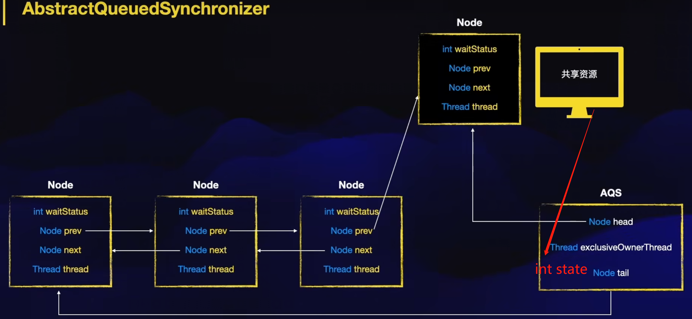
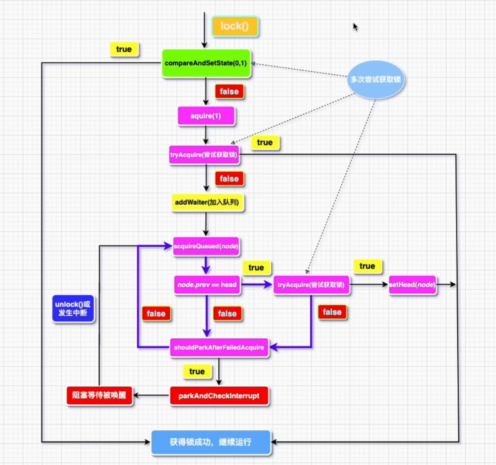

[toc]

# AQS简介

## 介绍

AQS是一个抽象队列同步器，主要用于实现对资源的同步机制。我们编程中常用到的线程同步相关类，例如ReentrantLock、CountDownLatch都是基于AQS实现。基于AQS，我们可以很容易的实现自定义规则的同步器。

## 使用场景

多线程同步场景。例如：业务场景存在多线程访问共享资源情况，发现多线程访问会存在线程安全问题，需要一套同步机制，使得同时只能有一个线程访问该资源。

## 常见的基于AQS实现的锁介绍

一般来说，常见的基于AQS是实现的锁有以下几种

（1）ReentrantLock----最常见的同步锁，同时只允许1个线程拿到锁。

（2）ReentrantReadWriteLock----读写锁，可以有多个线程拿到读锁，但同时只能有一个线程拿到写锁。

（3）Semaphore----信号量，初始化时指定N，同时只能有N个线程拿到锁。

# 核心相关概念

## 相关知识点

（1）Thread----AQS会对线程进行记录与管理，方便后续的竞争锁与阻塞唤醒判断

（2）LockSupport----通过LockSupport的park与unpark方法进行线程的阻塞与唤醒

（3）CAS----通过cas修改共享变量的值，避免多线程的安全问题（我们在看AQS代码时，每段代码都可以假设是不是可能会有两个线程同时执行的情况，而cas操作就保证了同时只有一个执行成功）

## AQS核心模型

核心模型图如下




核心变量解释

state:核心标志位，标志锁的占有状态。state==0代表未被锁定，state>0代表当前已有线程占有锁。

exclusiveOwnerThread：记录当前占有锁的线程。可以通过这个来判断可重入逻辑。

head：指向Node类，代表同步队列的头指针。锁释放时通过head节点去唤醒后续竞争锁的线程。

tail：指向Node类，代表同步队列的队尾指针。锁竞争失败时需要加入同步队列，成为队尾tail。


内部类Node

waitStatus:记录Node状态，waitStatus>0的Node是异常节点，唤醒时会被忽略。

prev:前指针，Node可以通过该变量去获取前驱节点。

next:后指针，Node可以通过改变量去获取后置节点。

thread:记录当前被阻塞的线程。

## AQS核心逻辑流程

核心加锁流程图如下：



可以结合AQS中的acquire方法源代码理解

**核心解锁逻辑这里不画图了，大家可以先去想想如果是自己写要如何实现，然后去看看源码的release方法**

# 实战----通过AQS实现一个不可重入锁

```java
package com.hx.test.service;

import java.util.concurrent.locks.AbstractQueuedSynchronizer;

public class HxLock extends AbstractQueuedSynchronizer {

    public void lock(){
        acquire(1);
    }

    public void unLock(){
        release(1);
    }

    @Override
    protected final boolean tryAcquire(int args){
        if(getState()==0){
            if (compareAndSetState(0, args)) {
                setExclusiveOwnerThread(Thread.currentThread());
                return true;
            }
        }
        return false;
    }

    @Override
    protected final boolean tryRelease(int args){
        Thread exclusiveOwnerThread = getExclusiveOwnerThread();
        //不是当前线程释放锁抛异常
        if(Thread.currentThread()!=exclusiveOwnerThread){
            throw new IllegalMonitorStateException();
        }
        //清空占用状态
        setExclusiveOwnerThread(null);
        setState(0);
        return true;
    }


}

```