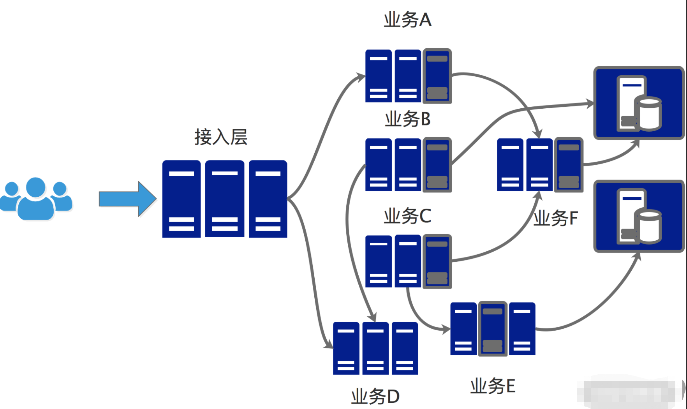
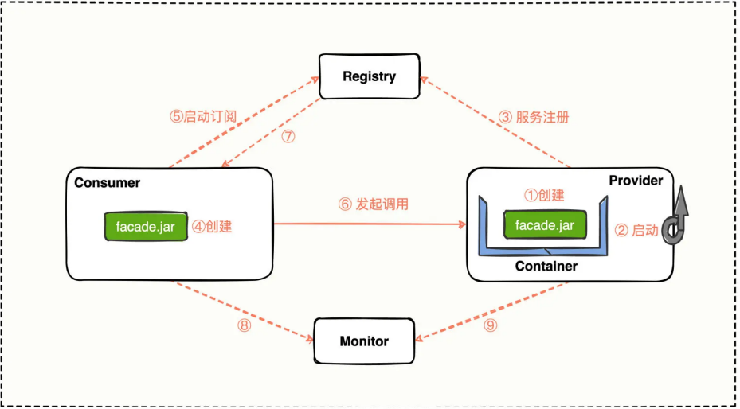
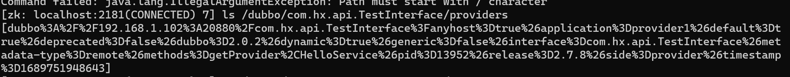
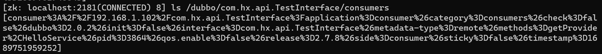
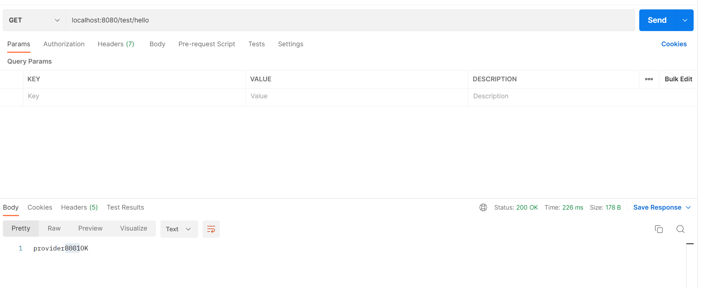

# 为啥要用dubbo

## dubbo的应用场景

当公司的服务满足以下要求时，可以考虑开始接入dubbo框架

（1）公司服务由单机式架构扩展到分布式架构，各个节点有着频繁的远程调用场景。

（2）对于远程调用的性能、扩展性有要求。

典型业务系统如下：




## dubbo的优势（与其他RPC方式的对比）

相对于其他的RPC框架，dubbo主要有以下三个优势

（1）性能高。dubbo的rpc协议支持二进制序列化，报文大小精简。

（2）灵活性强。dubbo采用spi机制，可以根据需要选择合适的插件实现。

（2）扩展性强。dubbo预留了许多扩展点，开发者可以根据需要配置或者开发扩展功能。

# dubbo的总体架构

## 总体架构图

dubbo告别了传统的webservice的服务模式，使用consumer，provider模式进行服务。

总体架构图如下：



## 各个模块功能简介

**服务提供者Provider**：暴露接口提供服务。

**服务消费者Consumer**：调用已暴露的接口服务。

**注册中心Registry**：管理暴露的接口服务信息。

**监控中心Monitor**：统计服务调用次数和信息。

## 核心交互流程

（1）服务提供者启动，将暴露的接口服务信息注册到注册中心。

（2）服务消费者启动，向注册中心订阅所需要的接口服务信息，并把信息存储到本地缓存中。

（3）服务消费者根据本地缓存信息发起远程调用。

（4）服务消费者、服务提供者定期向监控中心同步监控信息。


# dubbo的简单使用

##一.创建公共接口

dubbo是面向接口调用的，消费者和提供者都要按照接口规范进行调用，实现。

```java
package com.hx.api;

public interface TestInterface {
    void HelloService();
    int getProvider();
}
```

##二.启动服务提供者

（1）这里选择注解方式接入

```java
package com.hx.provider.service;

import com.hx.api.TestInterface;
import org.apache.dubbo.config.annotation.DubboService;
import org.springframework.beans.factory.annotation.Value;

@DubboService
public class TestInterfaceImpl implements TestInterface {
    @Value("${server.port}")
    private int port;

    @Override
    public void HelloService() {
        System.out.println("Hello dubbo");
    }

    @Override
    public int getProvider() {
        return port;
    }
}

```

（2）需要配置注册中心相关依赖

```sql
dubbo:
  application:
    name: provider1
  registry:
    address: zookeeper://127.0.0.1:2181
    protocol:
      id: dubbo
      name: dubbo
      port: 20880
```
（3）服务启动成功后可以看到zk上的注册信息



##三.启动服务消费者

（1）这里选择注解方式接入
```java
package com.hx.consumer.controller;

import com.hx.api.TestInterface;
import org.apache.dubbo.config.annotation.DubboReference;
import org.springframework.web.bind.annotation.GetMapping;
import org.springframework.web.bind.annotation.RequestMapping;
import org.springframework.web.bind.annotation.RestController;

@RestController
@RequestMapping("/test")
public class TestController {
    @DubboReference
    private TestInterface testInterface;

    @GetMapping("/hello")
    public String hello(){
        testInterface.HelloService();
        int a = testInterface.getProvider();
        return "provider"+a+"OK";
    }
}

```

（2）需要配置注册中心相关依赖

```sql
dubbo:
  application:
    name: consumer
  registry:
    address: zookeeper://127.0.0.1:2181
    protocol:
      id: dubbo
      name: dubbo
      port: 20880
```

（3）服务启动成功后可以看到zk上的注册信息



##四.发起调用




