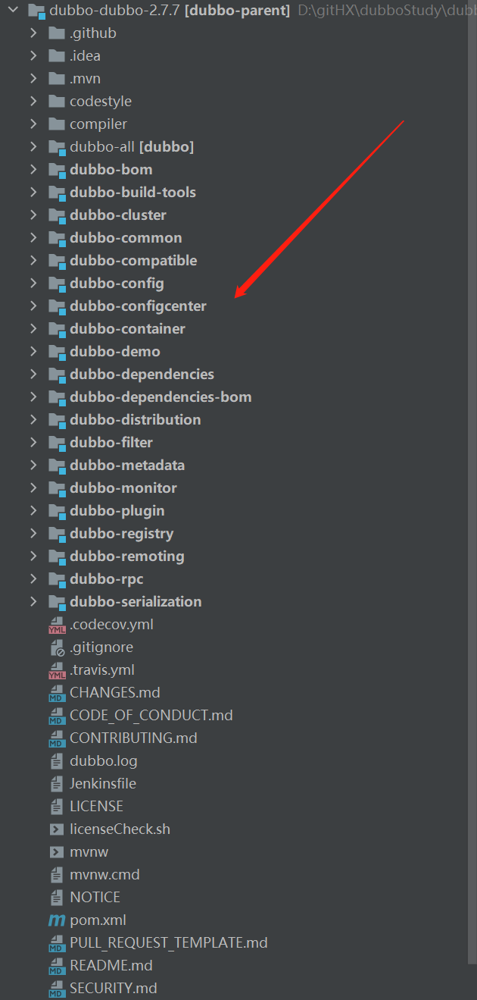
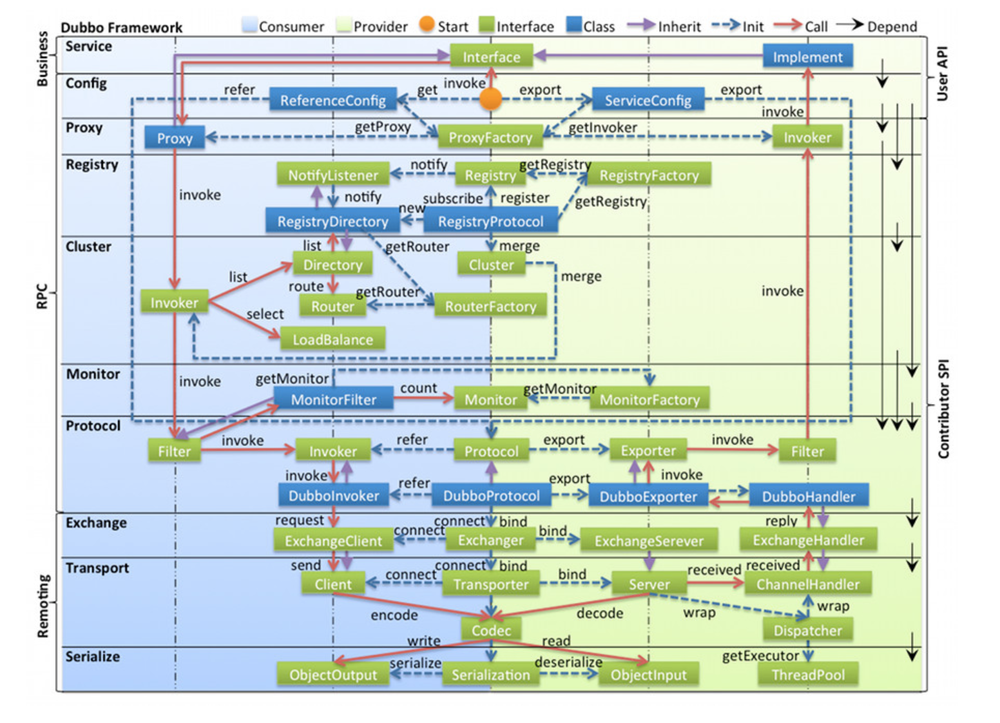
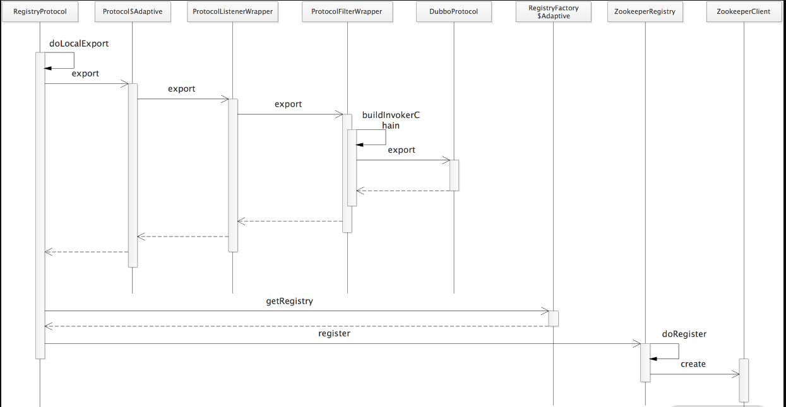

# 引子--dubbo的设计思路

通过上章节的引入，我们对dubbo大致有一个简单了解。现在我们换个角度来想，如果让我们来实现一个远程调用框架，我们应该如何设计呢？以关键的调用过程来看，我们来推测dubbo为我们隐去了哪些细节？

（1）为啥我们可以以一个注解，就可以像调本地方法一样发起一个远程调用？

dubbo框架肯定使用了代理模式，为我们动态生成了代理bean，这个bean里面拥有远程调用的全过程。

（2）远程调用应该如何实现？

服务端开放端口监听，客户端通过url和port与服务端建立Socket连接，两者定义好一致的通信协议。

（3）如何设计高性能、高扩展性的RPC框架？

高性能：（1）选择高性能的序列化协议（2）通信数据包尽可能精简。

高扩展性：（1）用户可以根据需要灵活选择底层实现（2）预留扩展点供用户扩展。

# 概括--dubbo源码包简介

这里都是以dubbo-2.7.7版本为例

## dubbo源码包结构



## 关键包功能介绍

最重要的几个包如下：
(1)dubbo-common:dubbo的公共模块。其中有很多工具类以及公共逻辑，dubbo的spi实现，时间轮实现都在此源码包中。
(2)dubbo-registry:dubbo与注册中心进行交互的模块。该模块灵活性强，dubbo-registry-api定义了统一规范，其他模块都是api的具体实现，支持开发者根据自己需要选择合适的注册中心接入。
(3)dubbo-rpc:dubbo 中对远程调用协议进行抽象的模块。该模块灵活性强，dubbo-rpc-api 定义了统一规范,其他子模块是针对具体协议的实现，持开发者根据自己需要选择合适的通信协议接入。该模块专注于rpc调用过程。
(4)dubbo-remoting:dubbo的远程通信模块。该模块灵活性强，dubbo-remoting-api 定义了统一规范,其他子模块是针对具体协议的实现，持开发者根据自己需要选择合适的底层远程通信方式接入。该模块专注于rpc调用过程的底层支持。
(5)dubbo-cluster:dubbo 中负责管理集群的模块。提供了负载均衡、容错、路由等一系列集群相关的功能，将多个 Provider 伪装为一个 Provider调用。

其他包功能介绍

(1)dubbo-monitor: dubbo 的监控模块。主要用于统计服务调用次数、调用时间以及实现调用链跟踪的服务。
(2)dubbo-config: dubbo的配置模块。负责配置的解析和加载，开发者只需要根据配置规则配置即可。
(3)dubbo-metadata: dubbo 的元数据模块。该模块灵活性强，dubbo-metadata-api 定义了统一规范,其他子模块是针对具体协议的实现，持开发者根据自己需要选择合适的元数据存储方式。
(4)dubbo-configcenter:dubbo 的动态配置模块，主要负责外部化配置以及服务治理规则的存储与通知，提供了多个子模块用来接入多种开源的服务发现组件。


# 基础--dubbo的spi机制简介

## spi机制

spi，服务提供者接口。当系统需要某种服务实现时，但是又不方便直接实现该功能，可以定义spi接口与配置规则。后续开发者根据需要直接引入满足spi规范的第三方依赖即可实现该功能。例如：jdk里的数据库驱动接口，由于数据库是编程的重点，所以很大概率需要此功能，但是数据库众多，jdk不方便将每种具体实现全部写在源码。所以jdk定义了Driver接口与spi接入规范，第三方数据库厂家只需要根据规范实现Driver接口即可。


## jdk与dubbo的spi机制对比

jdk的spi接入
```sql
(1)定义spi接口
public interface Log { 
    void log(String info);
} 
(2)实现spi接口
public class Logback implements Log { 
    @Override 
    public void log(String info) { 
        System.out.println("Logback:" + info);
} 
}
public class Log4j implements Log { 
    @Override 
    public void log(String info) { 
        System.out.println("Log4j:" + info);
    } 
} 
(3)按照规范添加配置文件
在项目的 resources/META-INF/services 目录下添加一个名为 com.xxx.Log 的文件，这是 JDK SPI 需要读取的配置文件，具体内容如下：
com.xxx.impl.Log4j 
com.xxx.impl.Logback

```

dubbo的spi接入
```sql
(1)定义spi接口
@SPI("log4j")
public interface Log { 
    void log(String info);
} 
(2)实现spi接口
public class Log4j implements Log { 
    @Override 
    public void log(String info) { 
        System.out.println("Log4j:" + info);
} 
public class Log4j implements Log { 
    @Override 
    public void log(String info) { 
        System.out.println("Log4j:" + info);
} 
} 
(3)按照规范添加配置文件
在项目的META-INF/services/目录(该目录下的 SPI 配置文件用来兼容 JDK SPI)、
META-INF/dubbo/ 目录(该目录用于存放用户自定义 SPI 配置文件)、
META-INF/dubbo/internal/目录（该目录用于存放 Dubbo 内部使用的 SPI 配置文件）下添加一个名为 com.xxx.Log 的文件，这是 JDK SPI 需要读取的配置文件，具体内容如下：

log4j=com.xxx.impl.Log4j 
logback=com.xxx.impl.Logback

```

两者的对比

dubbo的spi机制更为灵活强大，主要体现在以下几个方面

（1）支持按照需要加载实现类。jdk每次会加载配置文件中记载的所有实现类，dubbo可以根据spi接口上的注解value实现按需加载实现类。

（2）配置文件灵活。dubbo存在三个配置文件目录，利于对实现类的管理；dubbo配置文件为k-v形式，利于管理与定位错误。

（3）dubbo的spi加载机制更为强大，具体见后续源码。在进行spi的具体实现类实例化时，还会进行依赖注入，wapper包装，初始化操作。


## dubbo的spi底层实现

dubbo的spi实用典型方式为----
```java
Protocol protocol = ExtensionLoader
.getExtensionLoader(Protocol.class).getExtension("dubbo");
```
所以，spi底层实现核心在ExtensionLoader类中的getExtension方法

```java
public T getExtension(String name) {
        if (StringUtils.isEmpty(name)) {
            throw new IllegalArgumentException("Extension name == null");
        }
        if ("true".equals(name)) {
            return getDefaultExtension();
        }
        final Holder<Object> holder = getOrCreateHolder(name);
        Object instance = holder.get();
        
        if (instance == null) {
            synchronized (holder) {
                instance = holder.get();
                if (instance == null) {
                    instance = createExtension(name);
                    holder.set(instance);
                }
            }
        }
        return (T) instance;
    }
```
主要逻辑是从缓存中拿取实例，我们着重看创建实例过程createExtension
```java
private T createExtension(String name) {
        //通过name拿到class对象
        Class<?> clazz = getExtensionClasses().get(name);
        if (clazz == null) {
            throw findException(name);
        }
        try {
            T instance = (T) EXTENSION_INSTANCES.get(clazz);
            if (instance == null) {
                //1.通过反射创建实例
                EXTENSION_INSTANCES.putIfAbsent(clazz, clazz.newInstance());
                instance = (T) EXTENSION_INSTANCES.get(clazz);
            }
            //2.进行依赖注入
            injectExtension(instance);
            //3.生成wapper包装类
            Set<Class<?>> wrapperClasses = cachedWrapperClasses;
            if (CollectionUtils.isNotEmpty(wrapperClasses)) {
                for (Class<?> wrapperClass : wrapperClasses) {
                    instance = injectExtension((T) wrapperClass.getConstructor(type).newInstance(instance));
                }
            }
            //4.执行初始化方法
            initExtension(instance);
            return instance;
        } catch (Throwable t) {
            throw new IllegalStateException("Extension instance (name: " + name + ", class: " +
                    type + ") couldn't be instantiated: " + t.getMessage(), t);
        }
    }
```

spi底层实现总结

（1）扫描配置文件，得到name与class的对应关系。具体代码可见org.apache.dubbo.common.extension.ExtensionLoader#loadExtensionClasses

（2）实例化具体实现类。具体代码见org.apache.dubbo.common.extension.ExtensionLoader#createExtension


## 扩展注解@Adaptive、@Activate

###（1）Adaptive介绍

作用：可以动态获取spi接口的具体实现类。一般用来作适配器。例如：spi接口有多个适用于不同场景的实现，需要根据当前参数选择合适的实现。我们可以写一个适配器来做适配转发作用。

用法1：修饰在实现spi接口的子类上。在获取spi接口的具体实现类时，执行该子类的方法。可以参考dubbo源码中的ExtensionFactory接口。

用法2：修饰在spi接口的方法上。dubbo会生成一个子类方法，根据URL参数选择具体的子类实例。可以参考Transporter类。

###（2）Activate

作用：可以动态激活spi接口的具体实现类。一般用来做激活作用。例如：spi接口有着多个实现，需要在当前调用为消费者才生效，我们可以使用Activate注解指定当前调用为消费者才生效。

用法：修饰在实现spi接口的子类上。通过读取当前配置总线URL信息，与Activate注解信息进行匹配，只有匹配上才激活该spi接口的子类。参考dubbo中的Filter类。

# 基础--dubbo核心类概念

## 配置总线URL

### 为啥要用？

因为dubbo采用分层、可拔插的插件化设计，在进行模块间的调用时，不可避免地需要进行上下文参数地传递。为了降低沟通修改成本，统一规范，dubbo采用URL类作为上下文传递的核心类。我们可以从URL类对象中的参数，来获取相应的上下文信息。（假设一下，不过不统一规范，我们各自采用自定义的字符串或者map传参，会给后续的代码维护带来多大麻烦）

### URL类结构

参照URL源码的构造方法
```java
 public URL(String protocol,
               String username,
               String password,
               String host,
               int port,
               String path,
               Map<String, String> parameters,
               Map<String, Map<String, String>> methodParameters) {
        if (StringUtils.isEmpty(username)
                && StringUtils.isNotEmpty(password)) {
            throw new IllegalArgumentException("Invalid url, password without username!");
        }
        //1.协议名
        this.protocol = protocol;
        //2.用户名与密码
        this.username = username;
        this.password = password;
        //3.host与port
        this.host = host;
        this.port = Math.max(port, 0);
        this.address = getAddress(this.host, this.port);

        // trim the beginning "/"
        while (path != null && path.startsWith("/")) {
            path = path.substring(1);
        }
        //4.接口全路径（dubbo默认是以接口为单位暴露服务的）
        this.path = path;
        if (parameters == null) {
            parameters = new HashMap<>();
        } else {
            parameters = new HashMap<>(parameters);
        }
        //5.自定义参数，供开发者扩展，注意不与已存在参数重复即可
        this.parameters = Collections.unmodifiableMap(parameters);
        //6.方法名列表
        this.methodParameters = Collections.unmodifiableMap(methodParameters);
    }
```
常见的URL如下：

registry URL：registry://127.0.0.1:2181/org.apache.dubbo.registry.RegistryService?application=dubbo-demo-annotation-provider&dubbo=2.0.2&export=dubbo%3A%2F%2F192.168.1.102%3A20880%2Forg.apache.dubbo.demo.DemoService%3Fanyhost%3Dtrue%26application%3Ddubbo-demo-annotation-provider%26bind.ip%3D192.168.1.102%26bind.port%3D20880%26deprecated%3Dfalse%26dubbo%3D2.0.2%26dynamic%3Dtrue%26generic%3Dfalse%26interface%3Dorg.apache.dubbo.demo.DemoService%26methods%3DsayHello%2CsayHelloAsync%26pid%3D21964%26release%3D%26side%3Dprovider%26timestamp%3D1689920336824&pid=21964&registry=zookeeper&timestamp=1689920336820

provider URL：dubbo://192.168.1.102:20880/org.apache.dubbo.demo.DemoService?anyhost=true&application=dubbo-demo-annotation-provider&deprecated=false&dubbo=2.0.2&dynamic=true&generic=false&interface=org.apache.dubbo.demo.DemoService&methods=sayHello,sayHelloAsync&pid=16452&release=&side=provider&timestamp=1689920530458

consumer URL：consumer://192.168.1.102/org.apache.dubbo.demo.DemoService?application=dubbo-demo-annotation-consumer&category=consumers&check=false&dubbo=2.0.2&init=false&interface=org.apache.dubbo.demo.DemoService&methods=sayHello,sayHelloAsync&pid=5140&side=consumer&sticky=false&timestamp=1689920580298

## 调用过程Invoker

### 为啥要用Invoker？

因为一次远程RPC调用过程涉及到许多核心类，而这些核心类都是分层架构，实现细节复杂。为了更好地描述调用过程，统一规范，引入了invoker这一抽象概念。Invoker是实体域，它是 Dubbo 的核心模型，其它模型都向它靠扰，或转换成它，它代表一个可执行体，可向它发起 invoke 调用。

### Invoker源码

```java

/**
 * Invoker. (API/SPI, Prototype, ThreadSafe)
 *
 * @see org.apache.dubbo.rpc.Protocol#refer(Class, org.apache.dubbo.common.URL)
 * @see org.apache.dubbo.rpc.InvokerListener
 * @see org.apache.dubbo.rpc.protocol.AbstractInvoker
 */
public interface Invoker<T> extends Node {

    /**
     * get service interface.
     *
     * @return service interface.
     */
    Class<T> getInterface();

    /**
     * invoke.
     *
     * @param invocation
     * @return result
     * @throws RpcException
     */
    Result invoke(Invocation invocation) throws RpcException;

}
```
对于consumer端来说，invoke方法对应一次远程调用，里面封装了远程通信地细节，对于provider端来说，invoke方法对应一次本地调用。


# 核心--关键过程源码解读

先看一张流程图，虽然现在肯定看不懂



分层概述：

config 配置层：对外配置接口，以 ServiceConfig, ReferenceConfig 为中心，可以直接初始化配置类，也可以通过 spring 解析配置生成配置类。

proxy 服务代理层：服务接口透明代理，生成服务的客户端 Stub 和服务器端 Skeleton, 以 ServiceProxy 为中心，扩展接口为 ProxyFactory。

registry 注册中心层：封装服务地址的注册与发现，以服务 URL 为中心，扩展接口为 RegistryFactory, Registry, RegistryService。

cluster 路由层：封装多个提供者的路由及负载均衡，并桥接注册中心，以 Invoker 为中心，扩展接口为 Cluster, Directory, Router, LoadBalance。

monitor 监控层：RPC 调用次数和调用时间监控，以 Statistics 为中心，扩展接口为 MonitorFactory, Monitor, MonitorService。

protocol 远程调用层：封装 RPC 调用，以 Invocation, Result 为中心，扩展接口为 Protocol, Invoker, Exporter
exchange 信息交换层：封装请求响应模式，同步转异步，以 Request, Response 为中心，扩展接口为 Exchanger, ExchangeChannel, ExchangeClient, ExchangeServer。

transport 网络传输层：抽象 mina 和 netty 为统一接口，以 Message 为中心，扩展接口为 Channel, Transporter, Client, Server, Codec。

serialize 数据序列化层：可复用的一些工具，扩展接口为 Serialization, ObjectInput, ObjectOutput, ThreadPool
关系说明。

## provider暴露服务过程

由于使用注解方式或者xml配置我们很难去debug源码，这里建立用api方式接入dubbo，我们通过api方式来debug源码。

provider启动源码如下：
```java

package org.apache.dubbo.demo.provider;

import org.apache.dubbo.config.ApplicationConfig;
import org.apache.dubbo.config.RegistryConfig;
import org.apache.dubbo.config.ServiceConfig;
import org.apache.dubbo.config.bootstrap.DubboBootstrap;
import org.apache.dubbo.demo.DemoService;

import java.util.concurrent.CountDownLatch;

public class Application {
    public static void main(String[] args) throws Exception {
        if (isClassic(args)) {
            startWithExport();
        } else {
            startWithBootstrap();
        }
    }

    private static boolean isClassic(String[] args) {
        return args.length > 0 && "classic".equalsIgnoreCase(args[0]);
    }

    private static void startWithBootstrap() {
        ServiceConfig<DemoServiceImpl> service = new ServiceConfig<>();
        service.setInterface(DemoService.class);
        service.setRef(new DemoServiceImpl());

        DubboBootstrap bootstrap = DubboBootstrap.getInstance();
        bootstrap.application(new ApplicationConfig("dubbo-demo-api-provider"))
                .registry(new RegistryConfig("zookeeper://127.0.0.1:2181"))
                .service(service)
                //我们着重关注该方法
                .start()
                .await();
    }

    private static void startWithExport() throws InterruptedException {
        ServiceConfig<DemoServiceImpl> service = new ServiceConfig<>();
        service.setInterface(DemoService.class);
        service.setRef(new DemoServiceImpl());
        service.setApplication(new ApplicationConfig("dubbo-demo-api-provider"));
        service.setRegistry(new RegistryConfig("zookeeper://127.0.0.1:2181"));
        service.export();

        System.out.println("dubbo service started");
        new CountDownLatch(1).await();
    }
}

```

我们着重关注start()方法过程

```java
public DubboBootstrap start() {
        if (started.compareAndSet(false, true)) {
            ready.set(false);
            initialize();
            if (logger.isInfoEnabled()) {
                logger.info(NAME + " is starting...");
            }
            // 1. export Dubbo Services
            exportServices();

            // Not only provider register
            if (!isOnlyRegisterProvider() || hasExportedServices()) {
                // 2. export MetadataService
                exportMetadataService();
                //3. Register the local ServiceInstance if required
                registerServiceInstance();
            }

            referServices();
            if (asyncExportingFutures.size() > 0) {
                new Thread(() -> {
                    try {
                        this.awaitFinish();
                    } catch (Exception e) {
                        logger.warn(NAME + " exportAsync occurred an exception.");
                    }
                    ready.set(true);
                    if (logger.isInfoEnabled()) {
                        logger.info(NAME + " is ready.");
                    }
                }).start();
            } else {
                ready.set(true);
                if (logger.isInfoEnabled()) {
                    logger.info(NAME + " is ready.");
                }
            }
            if (logger.isInfoEnabled()) {
                logger.info(NAME + " has started.");
            }
        }
        return this;
    }
```
源码大致流程（1）初始化（2）导出服务--核心逻辑（3）引用服务。我们深入exportServices方法

```java
private void exportServices() {
        configManager.getServices().forEach(sc -> {
            // TODO, compatible with ServiceConfig.export()
            ServiceConfig serviceConfig = (ServiceConfig) sc;
            serviceConfig.setBootstrap(this);

            if (exportAsync) {
                ExecutorService executor = executorRepository.getServiceExporterExecutor();
                Future<?> future = executor.submit(() -> {
                    sc.export();
                    exportedServices.add(sc);
                });
                asyncExportingFutures.add(future);
            } else {
                sc.export();
                exportedServices.add(sc);
            }
        });
    }
```
源码大致流程（1）从配置中拿到所有需要导出的服务（2）根据异步需要采用不同方式导出服务。我们深入export方法

```java
public synchronized void export() {
        if (!shouldExport()) {
            return;
        }

        if (bootstrap == null) {
            bootstrap = DubboBootstrap.getInstance();
            bootstrap.init();
        }

        checkAndUpdateSubConfigs();

        //init serviceMetadata
        serviceMetadata.setVersion(version);
        serviceMetadata.setGroup(group);
        serviceMetadata.setDefaultGroup(group);
        serviceMetadata.setServiceType(getInterfaceClass());
        serviceMetadata.setServiceInterfaceName(getInterface());
        serviceMetadata.setTarget(getRef());

        if (shouldDelay()) {
            DELAY_EXPORT_EXECUTOR.schedule(this::doExport, getDelay(), TimeUnit.MILLISECONDS);
        } else {
            doExport();
        }

        exported();
    }
```
源码大致流程（1）检查默认配置参数（2）根据是否延时采用不同方式导出。我们深入doExport方法

```java
protected synchronized void doExport() {
        if (unexported) {
            throw new IllegalStateException("The service " + interfaceClass.getName() + " has already unexported!");
        }
        if (exported) {
            return;
        }
        exported = true;

        if (StringUtils.isEmpty(path)) {
            path = interfaceName;
        }
        doExportUrls();
    }
```
我们深入doExportUrls方法

```java
 private void doExportUrls() {
        ServiceRepository repository = ApplicationModel.getServiceRepository();
        ServiceDescriptor serviceDescriptor = repository.registerService(getInterfaceClass());
        repository.registerProvider(
                getUniqueServiceName(),
                ref,
                serviceDescriptor,
                this,
                serviceMetadata
        );

        List<URL> registryURLs = ConfigValidationUtils.loadRegistries(this, true);

        for (ProtocolConfig protocolConfig : protocols) {
            String pathKey = URL.buildKey(getContextPath(protocolConfig)
                    .map(p -> p + "/" + path)
                    .orElse(path), group, version);
            // In case user specified path, register service one more time to map it to path.
            repository.registerService(pathKey, interfaceClass);
            // TODO, uncomment this line once service key is unified
            serviceMetadata.setServiceKey(pathKey);
            doExportUrlsFor1Protocol(protocolConfig, registryURLs);
        }
    }
```
源码大致流程（1）获取所有注册中心对应的URL对象（2）将接口注册到对应的注册中心。我们深入doExportUrls方法。

```java
private void doExportUrlsFor1Protocol(ProtocolConfig protocolConfig, List<URL> registryURLs) {
        String name = protocolConfig.getName();
        if (StringUtils.isEmpty(name)) {
        name = DUBBO;
        }

        Map<String, String> map = new HashMap<String, String>();
        map.put(SIDE_KEY, PROVIDER_SIDE);

        ServiceConfig.appendRuntimeParameters(map);
        AbstractConfig.appendParameters(map, getMetrics());
        AbstractConfig.appendParameters(map, getApplication());
        AbstractConfig.appendParameters(map, getModule());
        // remove 'default.' prefix for configs from ProviderConfig
        // appendParameters(map, provider, Constants.DEFAULT_KEY);
        AbstractConfig.appendParameters(map, provider);
        AbstractConfig.appendParameters(map, protocolConfig);
        AbstractConfig.appendParameters(map, this);
        MetadataReportConfig metadataReportConfig = getMetadataReportConfig();
        if (metadataReportConfig != null && metadataReportConfig.isValid()) {
        map.putIfAbsent(METADATA_KEY, REMOTE_METADATA_STORAGE_TYPE);
        }
        if (CollectionUtils.isNotEmpty(getMethods())) {
        for (MethodConfig method : getMethods()) {
        AbstractConfig.appendParameters(map, method, method.getName());
        String retryKey = method.getName() + ".retry";
        if (map.containsKey(retryKey)) {
        String retryValue = map.remove(retryKey);
        if ("false".equals(retryValue)) {
        map.put(method.getName() + ".retries", "0");
        }
        }
        List<ArgumentConfig> arguments = method.getArguments();
        if (CollectionUtils.isNotEmpty(arguments)) {
        for (ArgumentConfig argument : arguments) {
        // convert argument type
        if (argument.getType() != null && argument.getType().length() > 0) {
        Method[] methods = interfaceClass.getMethods();
        // visit all methods
        if (methods.length > 0) {
        for (int i = 0; i < methods.length; i++) {
        String methodName = methods[i].getName();
        // target the method, and get its signature
        if (methodName.equals(method.getName())) {
        Class<?>[] argtypes = methods[i].getParameterTypes();
        // one callback in the method
        if (argument.getIndex() != -1) {
        if (argtypes[argument.getIndex()].getName().equals(argument.getType())) {
        AbstractConfig.appendParameters(map, argument, method.getName() + "." + argument.getIndex());
        } else {
        throw new IllegalArgumentException("Argument config error : the index attribute and type attribute not match :index :" + argument.getIndex() + ", type:" + argument.getType());
        }
        } else {
        // multiple callbacks in the method
        for (int j = 0; j < argtypes.length; j++) {
        Class<?> argclazz = argtypes[j];
        if (argclazz.getName().equals(argument.getType())) {
        AbstractConfig.appendParameters(map, argument, method.getName() + "." + j);
        if (argument.getIndex() != -1 && argument.getIndex() != j) {
        throw new IllegalArgumentException("Argument config error : the index attribute and type attribute not match :index :" + argument.getIndex() + ", type:" + argument.getType());
        }
        }
        }
        }
        }
        }
        }
        } else if (argument.getIndex() != -1) {
        AbstractConfig.appendParameters(map, argument, method.getName() + "." + argument.getIndex());
        } else {
        throw new IllegalArgumentException("Argument config must set index or type attribute.eg: <dubbo:argument index='0' .../> or <dubbo:argument type=xxx .../>");
        }

        }
        }
        } // end of methods for
        }

        if (ProtocolUtils.isGeneric(generic)) {
        map.put(GENERIC_KEY, generic);
        map.put(METHODS_KEY, ANY_VALUE);
        } else {
        String revision = Version.getVersion(interfaceClass, version);
        if (revision != null && revision.length() > 0) {
        map.put(REVISION_KEY, revision);
        }

        String[] methods = Wrapper.getWrapper(interfaceClass).getMethodNames();
        if (methods.length == 0) {
        logger.warn("No method found in service interface " + interfaceClass.getName());
        map.put(METHODS_KEY, ANY_VALUE);
        } else {
        map.put(METHODS_KEY, StringUtils.join(new HashSet<String>(Arrays.asList(methods)), ","));
        }
        }

        /**
         * Here the token value configured by the provider is used to assign the value to ServiceConfig#token
         */
        if(ConfigUtils.isEmpty(token) && provider != null) {
        token = provider.getToken();
        }

        if (!ConfigUtils.isEmpty(token)) {
        if (ConfigUtils.isDefault(token)) {
        map.put(TOKEN_KEY, UUID.randomUUID().toString());
        } else {
        map.put(TOKEN_KEY, token);
        }
        }
        //init serviceMetadata attachments
        serviceMetadata.getAttachments().putAll(map);

        // export service
        String host = findConfigedHosts(protocolConfig, registryURLs, map);
        Integer port = findConfigedPorts(protocolConfig, name, map);
        URL url = new URL(name, host, port, getContextPath(protocolConfig).map(p -> p + "/" + path).orElse(path), map);

        // You can customize Configurator to append extra parameters
        if (ExtensionLoader.getExtensionLoader(ConfiguratorFactory.class)
        .hasExtension(url.getProtocol())) {
        url = ExtensionLoader.getExtensionLoader(ConfiguratorFactory.class)
        .getExtension(url.getProtocol()).getConfigurator(url).configure(url);
        }

        String scope = url.getParameter(SCOPE_KEY);
        // don't export when none is configured
        if (!SCOPE_NONE.equalsIgnoreCase(scope)) {

        // export to local if the config is not remote (export to remote only when config is remote)
        if (!SCOPE_REMOTE.equalsIgnoreCase(scope)) {
        exportLocal(url);
        }
        // export to remote if the config is not local (export to local only when config is local)
        if (!SCOPE_LOCAL.equalsIgnoreCase(scope)) {
        if (CollectionUtils.isNotEmpty(registryURLs)) {
        for (URL registryURL : registryURLs) {
        //if protocol is only injvm ,not register
        if (LOCAL_PROTOCOL.equalsIgnoreCase(url.getProtocol())) {
        continue;
        }
        url = url.addParameterIfAbsent(DYNAMIC_KEY, registryURL.getParameter(DYNAMIC_KEY));
        URL monitorUrl = ConfigValidationUtils.loadMonitor(this, registryURL);
        if (monitorUrl != null) {
        url = url.addParameterAndEncoded(MONITOR_KEY, monitorUrl.toFullString());
        }
        if (logger.isInfoEnabled()) {
        if (url.getParameter(REGISTER_KEY, true)) {
        logger.info("Register dubbo service " + interfaceClass.getName() + " url " + url + " to registry " + registryURL);
        } else {
        logger.info("Export dubbo service " + interfaceClass.getName() + " to url " + url);
        }
        }

        // For providers, this is used to enable custom proxy to generate invoker
        String proxy = url.getParameter(PROXY_KEY);
        if (StringUtils.isNotEmpty(proxy)) {
        registryURL = registryURL.addParameter(PROXY_KEY, proxy);
        }

        Invoker<?> invoker = PROXY_FACTORY.getInvoker(ref, (Class) interfaceClass, registryURL.addParameterAndEncoded(EXPORT_KEY, url.toFullString()));
        DelegateProviderMetaDataInvoker wrapperInvoker = new DelegateProviderMetaDataInvoker(invoker, this);

        Exporter<?> exporter = PROTOCOL.export(wrapperInvoker);
        exporters.add(exporter);
        }
        } else {
        if (logger.isInfoEnabled()) {
        logger.info("Export dubbo service " + interfaceClass.getName() + " to url " + url);
        }
        Invoker<?> invoker = PROXY_FACTORY.getInvoker(ref, (Class) interfaceClass, url);
        DelegateProviderMetaDataInvoker wrapperInvoker = new DelegateProviderMetaDataInvoker(invoker, this);

        Exporter<?> exporter = PROTOCOL.export(wrapperInvoker);
        exporters.add(exporter);
        }
        /**
         * @since 2.7.0
         * ServiceData Store
         */
        WritableMetadataService metadataService = WritableMetadataService.getExtension(url.getParameter(METADATA_KEY, DEFAULT_METADATA_STORAGE_TYPE));
        if (metadataService != null) {
        metadataService.publishServiceDefinition(url);
        }
        }
        }
        this.urls.add(url);
        }
```
源码大致流程（1）按照优先级解析配置参数（2）构建URL对象。（3）着重关注这三行代码

```java
//(1)构建invoker实体对象，里面包含ref的内部调用
Invoker<?> invoker = PROXY_FACTORY.getInvoker(ref, (Class) interfaceClass, registryURL.addParameterAndEncoded(EXPORT_KEY, url.toFullString()));
//（2）使用wapper包装invoker，相当于做了个aop切面
DelegateProviderMetaDataInvoker wrapperInvoker = new DelegateProviderMetaDataInvoker(invoker, this);
//（3）将invoker封装为exporter对象暴露
Exporter<?> exporter = PROTOCOL.export(wrapperInvoker);
```
我们深入export方法，这里走有注册中心的版本即org.apache.dubbo.registry.integration.RegistryProtocol#export

```java
public <T> Exporter<T> export(final Invoker<T> originInvoker) throws RpcException {
        URL registryUrl = getRegistryUrl(originInvoker);
        // url to export locally
        URL providerUrl = getProviderUrl(originInvoker);

        // Subscribe the override data
        // FIXME When the provider subscribes, it will affect the scene : a certain JVM exposes the service and call
        //  the same service. Because the subscribed is cached key with the name of the service, it causes the
        //  subscription information to cover.
        final URL overrideSubscribeUrl = getSubscribedOverrideUrl(providerUrl);
        final OverrideListener overrideSubscribeListener = new OverrideListener(overrideSubscribeUrl, originInvoker);
        overrideListeners.put(overrideSubscribeUrl, overrideSubscribeListener);

        providerUrl = overrideUrlWithConfig(providerUrl, overrideSubscribeListener);
        //export invoker
        final ExporterChangeableWrapper<T> exporter = doLocalExport(originInvoker, providerUrl);

        // url to registry
        final Registry registry = getRegistry(originInvoker);
        final URL registeredProviderUrl = getUrlToRegistry(providerUrl, registryUrl);

        // decide if we need to delay publish
        boolean register = providerUrl.getParameter(REGISTER_KEY, true);
        if (register) {
            register(registryUrl, registeredProviderUrl);
        }

        // register stated url on provider model
        registerStatedUrl(registryUrl, registeredProviderUrl, register);

        // Deprecated! Subscribe to override rules in 2.6.x or before.
        registry.subscribe(overrideSubscribeUrl, overrideSubscribeListener);

        exporter.setRegisterUrl(registeredProviderUrl);
        exporter.setSubscribeUrl(overrideSubscribeUrl);

        notifyExport(exporter);
        //Ensure that a new exporter instance is returned every time export
        return new DestroyableExporter<>(exporter);
    }
```
源码大致流程（1）本地export---核心（2）注册信息到注册中心。（3）订阅并绑定listener。我们深入doLocalExport方法

```java
 private <T> ExporterChangeableWrapper<T> doLocalExport(final Invoker<T> originInvoker, URL providerUrl) {
        String key = getCacheKey(originInvoker);

        return (ExporterChangeableWrapper<T>) bounds.computeIfAbsent(key, s -> {
            Invoker<?> invokerDelegate = new InvokerDelegate<>(originInvoker, providerUrl);
            return new ExporterChangeableWrapper<>((Exporter<T>) protocol.export(invokerDelegate), originInvoker);
        });
    }
```

我们深入export方法，这里是providerUrl所以是org.apache.dubbo.rpc.protocol.dubbo.DubboProtocol#export实现

```java
public <T> Exporter<T> export(Invoker<T> invoker) throws RpcException {
        URL url = invoker.getUrl();

        // export service.
        String key = serviceKey(url);
        DubboExporter<T> exporter = new DubboExporter<T>(invoker, key, exporterMap);
        exporterMap.put(key, exporter);

        //export an stub service for dispatching event
        Boolean isStubSupportEvent = url.getParameter(STUB_EVENT_KEY, DEFAULT_STUB_EVENT);
        Boolean isCallbackservice = url.getParameter(IS_CALLBACK_SERVICE, false);
        if (isStubSupportEvent && !isCallbackservice) {
            String stubServiceMethods = url.getParameter(STUB_EVENT_METHODS_KEY);
            if (stubServiceMethods == null || stubServiceMethods.length() == 0) {
                if (logger.isWarnEnabled()) {
                    logger.warn(new IllegalStateException("consumer [" + url.getParameter(INTERFACE_KEY) +
                            "], has set stubproxy support event ,but no stub methods founded."));
                }

            }
        }

        openServer(url);
        optimizeSerialization(url);

        return exporter;
    }
```

源码大致流程（1）invoker转化为exporter（2）开启服务端server。（3）根据url设置合适的序列化优化器。


源码流程总结：

（1）按照配置优先级，依次解析配置。

（2）将得到的信息构建URL，构建invoker。

（3）invoker封装为exporter对象，注册相应信息到注册中心并开启server服务。

提示点：仔细看源码流程，你会发现调用链非常长，但是我们要根据provider启动流程核心逻辑抓住核心链路即可。   



## consumer远程调用过程

调用链路主要分为两个部分，consumer发送远程调用请求，provider接收请求响应。

consumer调用链路如下

```java
proxy0#sayHello(String)
  —> InvokerInvocationHandler#invoke(Object, Method, Object[])
    —> MockClusterInvoker#invoke(Invocation)
      —> AbstractClusterInvoker#invoke(Invocation)
        —> FailoverClusterInvoker#doInvoke(Invocation, List<Invoker<T>>, LoadBalance)
          —> Filter#invoke(Invoker, Invocation)  // 包含多个 Filter 调用
            —> ListenerInvokerWrapper#invoke(Invocation) 
              —> AbstractInvoker#invoke(Invocation) 
                —> DubboInvoker#doInvoke(Invocation)
                  —> ReferenceCountExchangeClient#request(Object, int)
                    —> HeaderExchangeClient#request(Object, int)
                      —> HeaderExchangeChannel#request(Object, int)
                        —> AbstractPeer#send(Object)
                          —> AbstractClient#send(Object, boolean)
                            —> NettyChannel#send(Object, boolean)
                              —> NioClientSocketChannel#write(Object)
```


provider接收请求处理链路,这里忽略了解码过程，
```java
NettyHandler#messageReceived(ChannelHandlerContext, MessageEvent)
  —> AbstractPeer#received(Channel, Object)
    —> MultiMessageHandler#received(Channel, Object)
      —> HeartbeatHandler#received(Channel, Object)
        —> AllChannelHandler#received(Channel, Object)
          —> ExecutorService#execute(Runnable)    // 由线程池执行后续的调用逻辑
        
        
//后续为线程池执行任务

ChannelEventRunnable#run()
  —> DecodeHandler#received(Channel, Object)
    —> HeaderExchangeHandler#received(Channel, Object)
      —> HeaderExchangeHandler#handleRequest(ExchangeChannel, Request)
        —> DubboProtocol.requestHandler#reply(ExchangeChannel, Object)
          —> Filter#invoke(Invoker, Invocation)
            —> AbstractProxyInvoker#invoke(Invocation)
              —> Wrapper0#invokeMethod(Object, String, Class[], Object[])
                —> DemoServiceImpl#sayHello(String)
```


参考链接：https://cn.dubbo.apache.org/zh-cn/docsv2.7/dev/design/