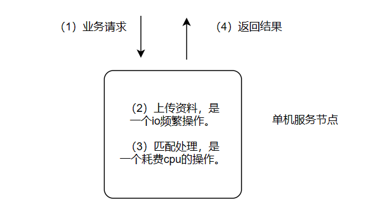
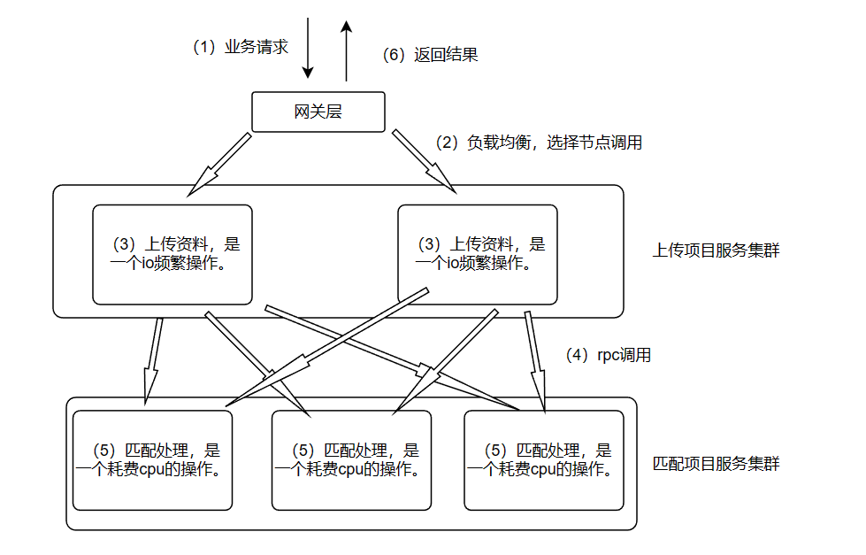
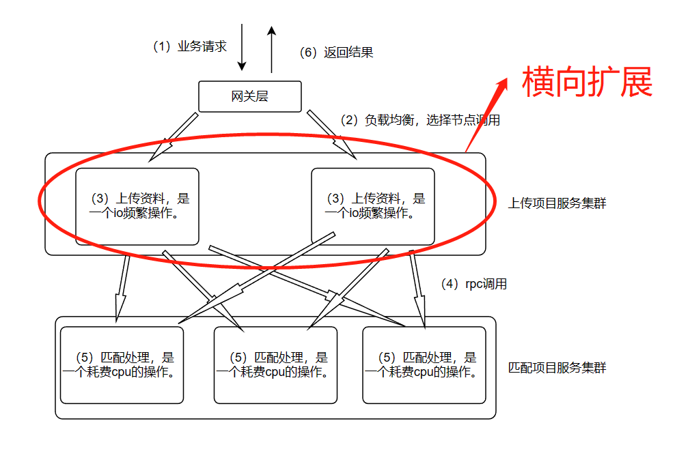
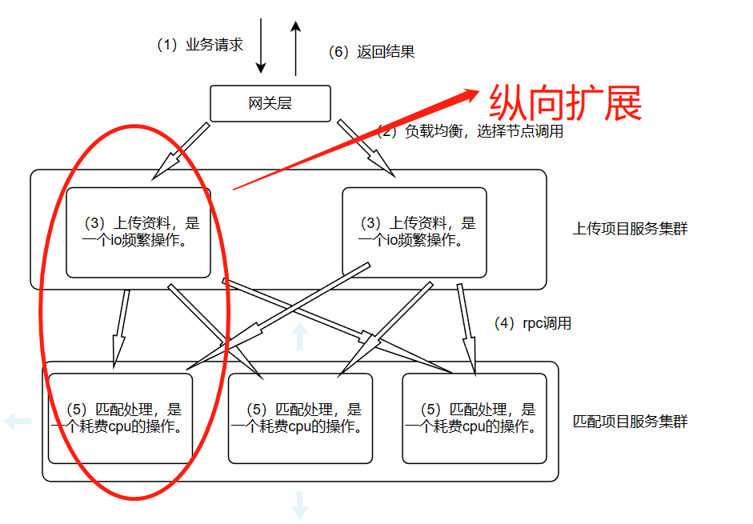

[toc]

在面试时，面试官会特别看重候选人对于分布式的理解。但是，分布式不像java中的某些具体技术，参照官方api即可快速入门了解，分布式更多的是一种技术思维。笔者认为学习分布式首先得理解分布式的思维方式，再结合具体的业务场景和具体的解决方案，才能真正理解分布式。

注意：本文章对于各种技术栈的理解定义不是特别学术化，如果要追求严格的定义建议wiki。

# 分布式与微服务的区别

## 分布式

（1）概念：一个任务使用多个服务器节点相互之间协调完成。
（2）使用场景：单台服务器节点处理工作任务吃力
（3）优点：分布式横向扩展可以提高系统的并发能力，分布式纵向扩展提高系统的单次请求处理性能。

## 微服务

（1）概念：按照业务功能分割成单独的服务项目，每个服务项目只负责自己的业务功能。
（2）使用场景：当前项目代码臃肿，职责不明。
（3）优点：微服务拆分后，项目职责明晰，利于后续项目的维护，也可以根据业务系统特点提高系统资源利用率。

**注意，实际上我们开发都会使用到这两种思想，特别地当我们进行分布式的纵向拆分时，拆分依据往往就是微服务的思想**

## 场景实例

### 目前项目情况

项目介绍：

这是一个业务上的匹配功能，需要先将用户的资料上传，上传归档后进行匹配推荐，推荐匹配的商品。目前是单机架构，只有一台服务器，这台服务器负责处理所有请求，负责执行所有上传任务和匹配任务。

当前难点：
（1）业务请求高峰期时，节点cpu和内存常常飙升到100%，极大地影响了性能，极端情况下甚至会宕机。而且由于业务请求量不均匀，不想因为这种偶发性的高并发请求而去采购成本高昂的服务器。
（2）由于同时需要处理io频繁任务以及cpu任务，对于服务器的带宽、内存、cpu均有很高的要求，服务器需要同时满足这些要求。
（3）所有代码写在同一个项目中，项目维护成本高。

### 解决方案

项目介绍：

优化点：
（1）将项目按照业务功能拆分为上传服务以及匹配服务，业务请求通过依次调用两个项目来处理。
（2）每个服务根据单个节点处理能力部署多个节点。
（3）接入网关层以及注册中心，每次调用时根据负载均衡策略选择合适的节点调用。

方案优点：

（1）对于偶尔的高并发请求，临时多部署几个节点分担请求压力。
（2）可以根据服务特点，给上传服务分配高内存高带宽的服务器资源，给匹配服务分配高性能cpu的服务器资源。对于单台服务器配置要求大大降低。
（3）由于已经按照功能划分了项目，可以让开发同学单独负责某一项目，减少了代码冲突，降低维护成本。

方案缺点：
（1）系统复杂度增加。

**扩展问题：发现目前匹配任务性能较低，但是匹配任务任务特点就是需要扫描所有商品进行推荐，应该如何优化？（将匹配任务进行分布式纵向拆分，每个节点处理一部分匹配商品任务，最后归总）**

# 典型的两种分布式模型

## 分布式横向扩展

特点：每个服务节点都是一个单独的状态机，不同服务节点的功能相同。

应用场景：高并发请求场景。

实例：MySQL读写分离架构，为了提高数据库系统读能力，我们可以对MySQL从节点横向扩展。

## 分布式纵向扩展

特点：不同服务节点都是负责处理不同任务，不同服务节点的功能不同。

应用场景：单节点处理请求性能较差，需要多个节点协调处理提升性能。

实例：MongoDB分片架构下，由于单节点无法存储海量数据，按照分片存储数据，聚合查询会查询每个分片节点，最后聚合结果返回。

**注意：不是纵向拆分后就一定提高请求性能，由于rpc调用开销的存在，拆分后性能可能更低**

# 常见的分布式相关技术栈

## RPC相关

（1）注册中心

注册中心向外提供提供查询服务、注册服务，此外当注册节点异常下线时，注册中心需要感知下线状态并通知订阅该节点的节点。常见的注册中心：nacos，zk。

（2）负载均衡策略

节点拿到节点信息后，必须决定调用哪一个具体节点。好的负载均衡策略可以充分利用系统资源，防止请求不合理造成系统故障。常见的负载均衡策略有:轮询、随机、权重。

（3）RPC协议

分布式节点之间需要相互进行RPC调用，必须规定好通信格式。常见的RPC协议有dubbo，HTTP，自定义协议。

**注意：其实HTTP也是RPC协议，但是因为RPC主要是公司内部服务调用，所以可以使用dubbo或者自定义协议来实现更高的性能**

（4）限流与熔断

限流：当担心节点处理过大流量时，可以接入限流器，限流器本质上就是在被调用后先执行限流策略，将多余的请求排队处理或者直接拒绝，防止节点因为异常流程被打垮。

熔断：当发现接口处理出现异常时，为了防止更多的异常请求造成系统的更大故障，让后续的请求直接执行熔断降级的代码。

由于熔断限流本质上都是对接口调用的监控统计，很多时候插件都是一起实现这两个功能。常见的熔断限流插件有Sentinel。

## 分布式服务协调相关

（1） 配置中心

开发人员配置的一些重要参数，配置中心应该提供稳定的查询接口以及通知接口，当配置中心的信息改变时，需要通知订阅该信息的节点。（其实和注册中心系统要求很像）常见的配置中心：naxos，zk。

（2）分布式id

服务需要生成id，并且需要满足id的唯一性（订单号，合同号）。常见的分布式id方法有：UUID，雪花算法，数据库自增，号段法。

（3）分布式锁

多个服务节点对共享资源的并发访问。常见的分布式锁实现：数据库分布式锁，redis分布式锁，zk分布式锁。

（4）分布式事务

实现多个分布式操作的事务性操作。单机版的事务性操作我们一般通过数据库实现，分布式下的事务更加复杂，而且由于网络的不稳定，一个完美的分布式事务标准并不存在。笔者也没有在公司中使用过，就不扩展了。

