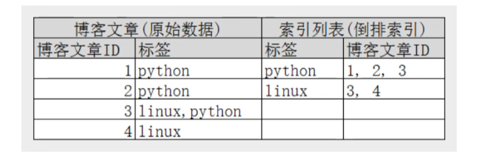

[toc]

在业务开发中，查询场景是最重要、最为频繁的一类场景。然而，我们会在实践中发现，作为业务开发最常见的关系型数据库MySql，往往满足不了某些特定的业务场景。由此，我们会设计一些扩展方案或者中间件来针对性地处理这些特殊场景（例如：设计缓存方案来优化高并发查询场景。）本次，文章要介绍一下复杂查询条件下的解决方案----数据搜索引擎es。

# es介绍

## es使用场景

当查询遇到以下场景可以考虑使用es。

（1）多个可变组合查询条件。mysql中，如果需要实现该场景的高效查询，只能建立联合索引，对联合索引的字段、顺序都有严格要求，但是由于查询条件是组合可变的，所以联合索引很难设计。es通过倒排索引以及高效的合并结果过程支持对该场景的高效查询。

（2）全文搜索，相关性匹配。mysql中，只支持前缀匹配，没有相关性匹配这种功能。es通过分词器以及倒排索引支持全文搜索，通过相关性评分机制支持相关性匹配。

## es中的关键概念

### 数据模型相关概念

（1）索引index。类似于mysql的表table。
（2）类型type。（8.0版本后废弃字段）
（3）文档document。类似于mysql的行row。注意文档是json格式。
（4）字段field。类似于mysql的字段field，但是es中的字段更加灵活。
（5）映射mapping。类似于mysql的表结构定义，es中可以不定义mapping，这样es会自动根据数据推断mapping，为了数据的统一性，建议显示定义mapping。

### 倒排索引

从文档里搜索一个关键字，普通的搜索算法，由于我们只具有文档到文档内容的映射关系，只能扫描每一个文档直至最后得出结果；倒排索引就是建立一个关键字到文档的映射关系，这样我们就可以直接得到关键字对应的文档集合。

倒排索引示例如下：

### 全文索引与分词器

当我们为全文text这种数据类型建立倒排索引时，分词器会把字符串按照一定规则分割为一个个的关键词，再用这些关键词构建倒排索引。为了刚好的搜索效果，需要合理选择分词器，合理设置分词规则。

### 相关性评分

当我们进行全文搜索时，理想情况下我们希望相关性高的结果返回在前面，低的返回在后面。es针对这种场景提供了score这一参数，在获取查询结果时，它会根据一定规则自动计算出score。一般来说，score参数的计算与以下几个因素有关，TF（关键词次数/文档长度，一般来说出现频率越高相关性越高），IDF（出现关键词的文档数/总文档数，一般频率越低相关性越高），调整规则（开发者设置的参数，可以用来调整某些具体关键词的相关性影响），总文本长度（一般总文本越短相关性越高）。

### 集群与分片

es默认会给所有字段建立倒排索引，其占用的空间是比较庞大的。所以，es设计之初就确立了分布式集群式的架构存储方案。在创建index时，可以指定index的分片数量和副本数量，es会将index数据分配到分片数量的节点存储，并且会将副本存储在其他节点，保证某一节点宕机时继续正常工作。

## es处理查询过请求程

es处理查询通常分为query与fetch两个阶段，具体如下

### （1）query阶段

（1）转发。Coordinate节点接收请求后，确认请求合法后，将请求转发到索引的所有hash分片节点，这些节点可能是主节点也可能是副本节点，但是全部一起会组成索引的全部数据。
（2）节点查询。接收到转发通知的节点分别执行查询操作，返回一个from+size个排序后的文档Id和排序值的优先队列给Coordinate节点。

### （2）fetch阶段

（1）集合取值。Coordinate节点根据每个节点返回的数据集进行排序组合，只保留from+size个排序后的文档Id。

（2）获取文档数据。Coordinate节点根据文档Id转发到对应分片获取文档数据，最后组装成最终结果返回给客户端。

**这个逻辑，就和解决topN问题的逻辑很像**

# es的真实使用案例

## 多条件组合查询

典型场景复现：目前存在一批商品，商品信息包含价格，标签，品牌名称，店铺评级，城市等等条件，需要满足客户可以根据这些条件自由组合查询。

es解决方案：
（1）使用es存储商品信息，每个字段为keyword精准匹配，实现高效率查询。
（2）可以指定查询方式为精准匹配，避免相关性打分过程，提高查询效率。
（3) 如果商品信息存在变更场景，可以采取变更接口添加更新es数据或者canal订阅修改日志异步解耦更新es。

## 搜索引擎

典型场景复现：存在一批博客文章，每篇博客文章都是非结构化数据，需要实现用户通过关键词搜索相关博客的功能。

es解决方案：
（1）使用es存储商品信息，博客字段为text，建立全文索引。
（2）可以对选择的分词器，分词规则，打分调整参数进行对比测试，实现更好的查询效果。

## elk系统

典型场景复现：需要实现一个日志系统，采集日志文件存储起来，并提供一个多条件查询日志接口，最好还要有一个易于操作的可视化页面。

elk解决方案：elk即是指elasticsearch+Logstash+Kibana，是一套海量数据查询可视化解决方案，常见于日志系统。Logstash是数据处理管道，负责将数据输出为标准化的格式；elasticsearch是搜索引擎，提供多条件复杂查询功能；Kibana是前端管理页面，实现数据的可视化。

