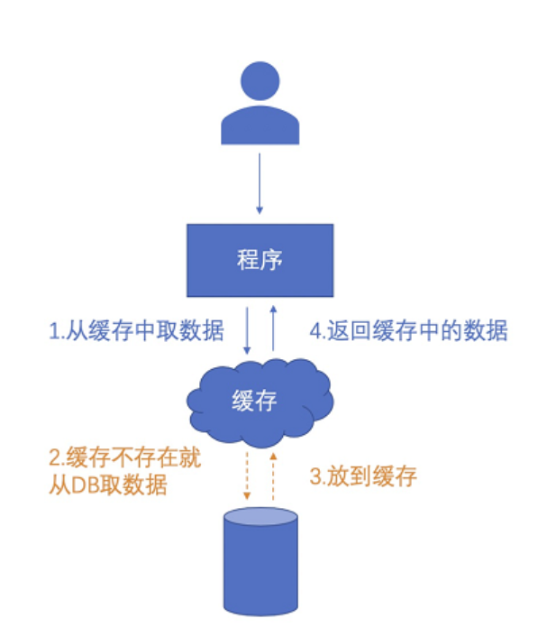

[toc]

在业务开发中，缓存是所有程序员绕不过去的一个知识点。

# 缓存介绍

## 缓存使用场景

当项目涉及到以下场景，可以考虑采用缓存。

（1）系统查询性能较低，需要优化。

（2）数据不需要长期保存，特殊场景下的数据丢失是可以接受的。

## 两种常见的缓存使用方式

### 本地缓存

实现方式：java中的Map，List等等容器都可以作为本地缓存，需要实现缓存的复杂功能建议使用guava，caffeine等缓存框架。

特点： （1）数据存储在服务器内存中，生命周期与服务器一致。（2）每台服务器的本地缓存都是不一致的。

### 第三方中间件缓存

实现方式：redis，memcache等等常见的缓存数据库。

特点：（1）数据存储在缓存数据库服务器的内存中，高度依赖第三方。（2）可以通过多台服务器依赖同一个缓存数据库实现缓存的一致性。

## 缓存的常见模型

# 缓存的常见问题（这里的第三方中间件都以redis为例）

## 缓存穿透，缓存击穿，缓存雪崩

（1）缓存穿透

场景：访问不存在的key，导致请求打到了数据存储层。

解决方法：（1）对空值也进行缓存。（2）布隆过滤器直接拒绝不存在key的查询请求。

（2）缓存击穿

场景：对某几个key的大批量并发访问打到了数据存储层，

解决方法：（1）对空值也进行缓存；（2）布隆过滤器直接拒绝不存在key的查询请求。（2）对数据存储层实现限流策略。

（3）缓存雪崩

场景：缓存在某段时间集中过期失效，导致大批量并发访问打到了数据层。

解决方法：（1）避免高频key批量过期

**注意：缓存穿透与缓存击穿主要是并发量的区别，缓存击穿与缓存雪崩主要是绕过缓存原因不同**

## 缓存不一致问题

缓存不一致主要分为两种问题

###（1）缓存数据与数据存储层数据不一致

不一致原因：更新缓存与更新数据库是两步操作，而不是一个原子性操作。

常见真实场景：（1）代码先执行更新缓存操作成功，后执行更新数据库操作失败了。（2）同时有两个进程在交替执行更新缓存，更新数据库的操作，可能最终结果缓存是A进程更新的值，数据库是B进程更新的值。

第一个场景解决很简单，我们在更新缓存与更新数据库之间不加入任何其他业务操作，并且先更新数据库，更新数据库成功后再更新缓存，这样两个命令执行结果一致。（一般来说，数据库存在数据规范限制，可能会执行失败，但是缓存一般无限制，只要执行命令即是成功）。

第二个场景常见的解决方案如下：（1）使用分布式锁。保证不同进程操作的顺序。（2）延迟删除策略。更新请求后定时执行一个删除缓存任务，在执行删除任务前仍然存在不一致问题。（3）手工删除或者等缓存失效。大部分情况不会并发修改缓存，实在出现了叫苦逼的开发删下缓存吧。或者没有人在乎，等缓存失效后下次就是一致了。

###（2）不同服务器节点的缓存数据不一致（主要针对本地缓存）

不一致原因：本地缓存都是各个服务节点私有的，更新缓存时，只更新到了处理改更新请求的服务节点的本地缓存，其他节点的缓存没有更新。

常见解决方案：发送更新请求到mq，广播其他节点去更新缓存。

## 缓存的热key问题（主要针对第三方中间件缓存）

场景：业务请求在某一时间段对于某几个key的访问特别频繁。

可能存在的风险： （1）请求并发量超过了redis的处理能力，请求性能下降，容易打垮redis服务。 （2）如果redis是分片集群架构，会造成请求不均的问题。

第一个风险的解决方案：再加一层本地缓存。

第二个风险的解决方案：将热点key的key值添加一些随机值，均匀存储到其他分片节点，请求查询时，给key加上随机值再去查询。

## 缓存的大key问题（主要针对第三方中间件缓存）

场景：缓存中存在一些特别大的value对象，每次取这些对象会消耗大量的内存与io资源。

造成大key的原因：（1）过大的对象或者字符串。（2）过长的列表，集合，hash对象。

针对第一种情况的解决方案：（1）减少不必要的字段。（2）使用压缩算法压缩内容。

针对第二种情况的解决方案：（1）超出预期大小后执行淘汰策略，将大小维持在预期范围内。（2）再hash法，将大value分割为不同对象，最后聚合取结果。

